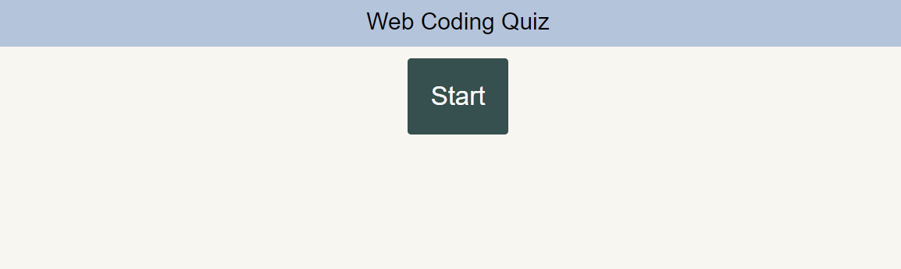
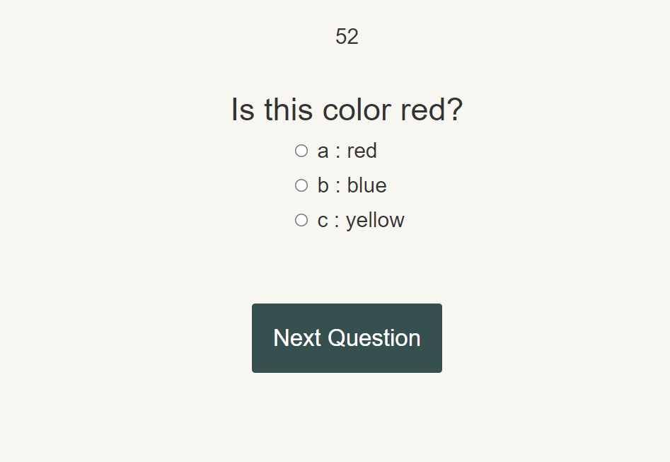
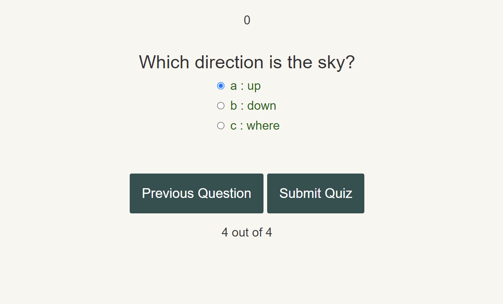

  # Code Quiz

  ----
  

  ----

### Description
Its a quiz that the user takes built on JavaScript.

## Table of Contents
- [Installation](#installation)
- [Usage](#usage)
- [License](#license)
- [Contribution](#contribution)
- [Test Instructions](#test-instructions)
- [Questions](#questions)

### Installation
Download or Clone the repo, and open in a code editor to start.

### Usage

### License
MIT
https://choosealicense.com/licenses/mit/

### License Details

MIT License

Copyright (c) [2022] [NiccoloEck]

### Contribution
niccolosaurus (Niccolo Eck)

### Test-Instructions
n/a

### Questions
[Github Profie](https://github.com/niccolosaurus) 

nicco.eck@gmail.com 

https://niccolosaurus.github.io/code-quiz/ 